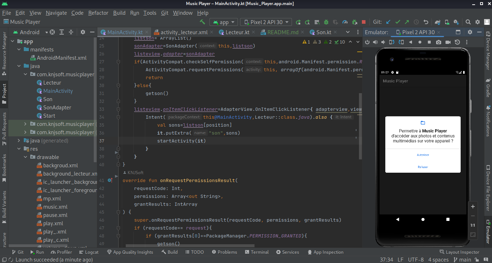

# Music Player

C'est une application mobile développée avec kotlin en trois(03) jours; c'est juste un lecteur audio simple a manipuler.

## Caractéristiques
- [x] Android
- [ ] IOS
- [x] Affiche toute la liste audio
- [x] Lecture du son
- [ ] Lecture si télephone en veille
- [x] Mise a jour en cour

## APK

Besoin de tester  l'application en version beta??? contacter moi pour avoir l'apk !!!
- 📫 Me contacter **knjprod@gmail.com / knjprod.py@gmail.com**